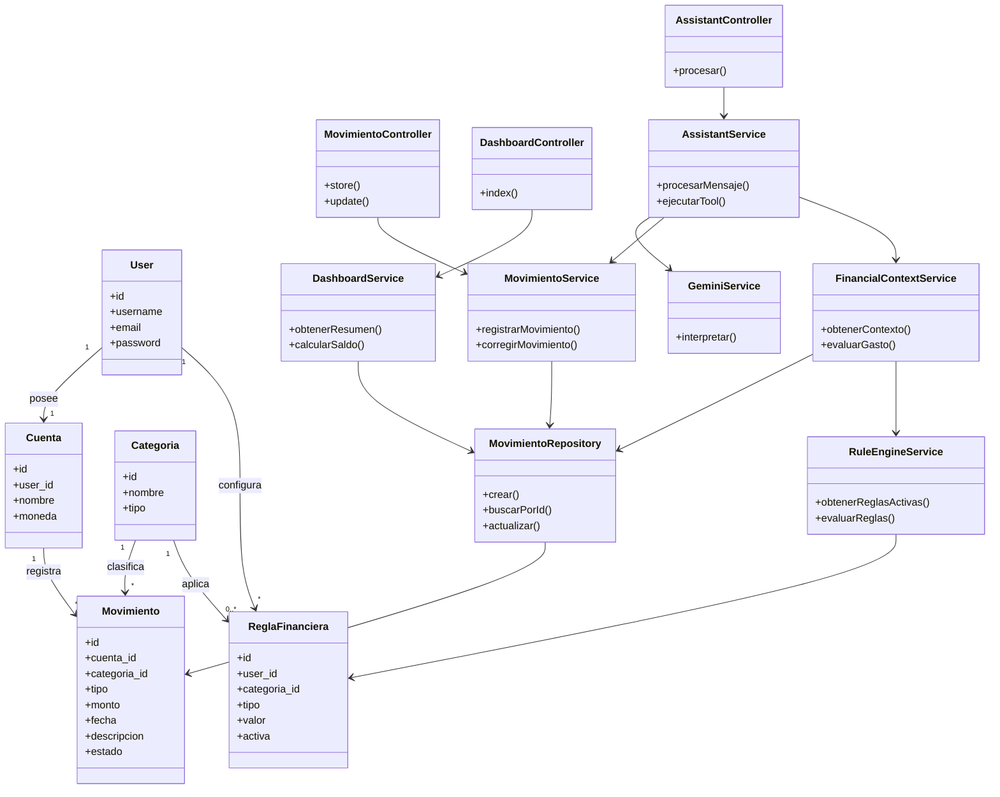

## Diagrama de clases - Primer flujo vertical

    Este diagrama representa la arquitectura inicial de Riplat para implementar el primer flujo vertical del sistema. La lógica de negocio se concentra en los servicios, mientras que los repositorios se encargan del acceso a los datos. Para el registro mediante lenguaje natural, el proveedor de IA interpreta el mensaje y genera una operación estructurada, pero la validación y ejecución quedan a cargo del backend en Laravel.