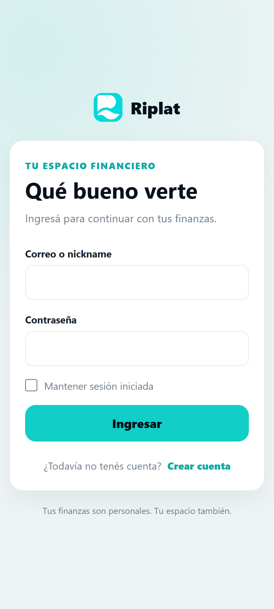
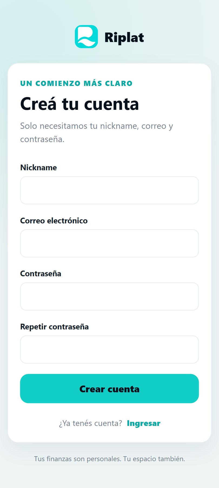
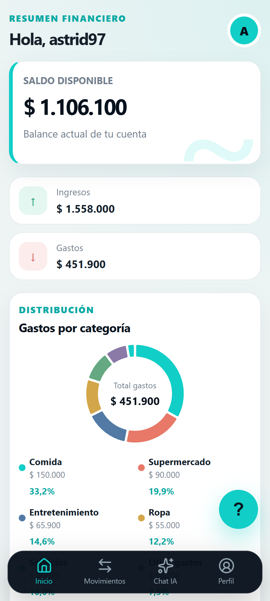
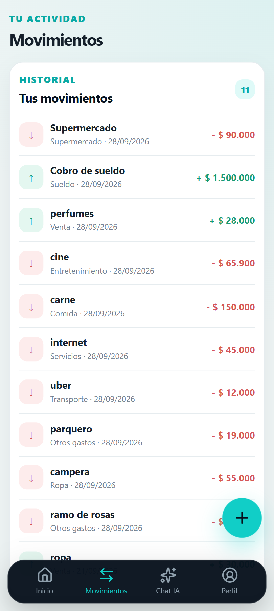
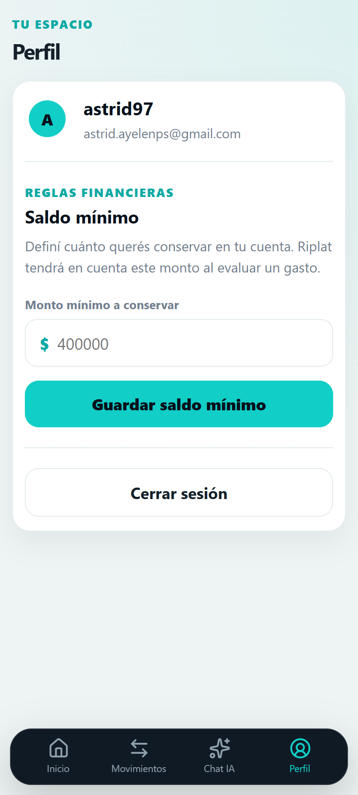
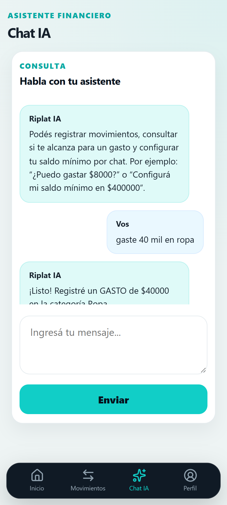
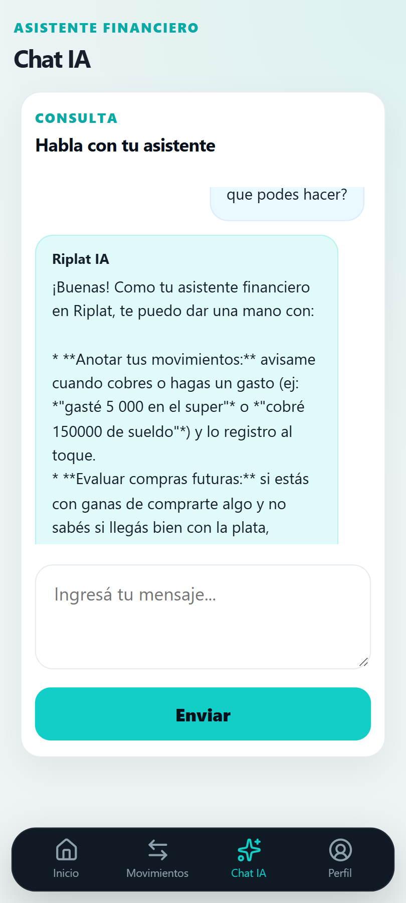
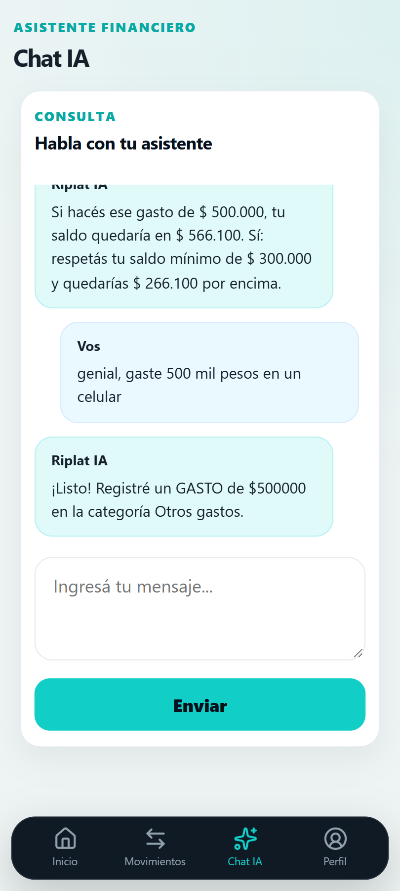

# Riplat - Asistente Financiero Inteligente

**2da entrega - Diseño y Módulos | 27 de Septiembre de 2026**

***Riplat*** es una Aplicación Web Progresiva (PWA) de gestión financiera personal. Su objetivo principal es simplificar el registro, organización y consulta de la información financiera del usuario mediante una interfaz de baja fricción, utilizando un asistente conversacional con Inteligencia Artificial como principal mecanismo de interacción.

## 🏗️ Arquitectura en Capas
Para garantizar un código escalable, testeable y de fácil mantenimiento, el proyecto no utiliza un patrón MVC tradicional, sino que implementa una Arquitectura en Capas estricta. La información se persiste en una base de datos relacional (SQL).

### Estructura del proyecto separando responsabilidades:

- Capa de Enrutamiento y Controladores (app/Http/Controllers): Interceptan las peticiones HTTP del frontend (como AssistantController), validan los datos de entrada y delegan la ejecución a los servicios correspondientes sin contener lógica de negocio.

- Capa de Servicios (app/Services): Contiene el núcleo de las reglas de negocio de Riplat. Aquí conviven servicios locales (como MovimientoService) y la lógica de Inteligencia Artificial (app/Services/IA/).

- Capa de Repositorios (app/Repositories): Encargada de abstraer las consultas a la base de datos, separando la lógica de acceso a datos de la lógica de negocio.

- Capa de Modelos (app/Models): Modelos Eloquent que representan las entidades del dominio.

## 🚀 Funcionalidades Implementadas (Estado Actual)
### 1. Autenticación y Seguridad

- Gestión de Usuarios: Sistema de registro con nickname, correo y contraseña. Permite el inicio de sesión flexible utilizando correo o nickname, y el cierre de sesión seguro.

- Aislamiento de Datos: Al registrarse, se crea una cuenta financiera individual. Las rutas están protegidas y validan estrictamente la sesión del usuario para garantizar que nadie pueda acceder a información ajena (comprobado mediante pruebas de aislamiento).

<p align="center">
  
  

</p>

### 2. Gestión Financiera Core

- Dashboard Interactivo: Panel principal que refleja el saldo actual, ingresos, gastos, actividad reciente y una distribución gráfica de gastos por categoría utilizando un donut de Chart.js.

- Movimientos: Consulta del historial y soporte para registro manual a través de un formulario modal con selección de categorías y validaciones de backend.

- Perfil y Evaluación de Gastos: El usuario puede configurar su "saldo mínimo" desde el perfil. El sistema utiliza esta regla para calcular el saldo posterior a una transacción simulada y advertir sobre su viabilidad.

<p align="center">
  
  
  
</p>

### 3. Asistente IA (Function Calling)
El módulo de Inteligencia Artificial fue diseñado bajo un enfoque de orquestación, donde Laravel mantiene el control absoluto de las operaciones para evitar alucinaciones algorítmicas:

- Infraestructura Aislada (GeminiService): Administra la comunicación HTTP con la API de Google Gemini. Gestiona la seguridad leyendo credenciales de config/services.php e implementa manejo de errores para distinguir problemas de cuota (HTTP 429), indisponibilidad de servidores de Google (HTTP 503) o configuración de la clave.

- Orquestador (AssistantService): Procesa el Function Calling. El modelo de lenguaje interpreta la intención del usuario y extrae parámetros estructurados, pero es Laravel quien valida los datos y ejecuta los cálculos mediante MovimientoService.

- Personalidad y Flexibilidad: El bot cuenta con un System Prompt que le otorga un tono amigable, cálido y argentino. Es capaz de mantener una charla fluida si el usuario lo saluda o se desvía del tema.

- Registro Conversacional: Permite registrar movimientos de INGRESOS / GASTOS mediante lenguaje natural.

- Consultas de Viabilidad: Evalúa compras futuras y configura el saldo mínimo a pedido del usuario, procesando consultas predictivas sin registrarlas erróneamente como un gasto consolidado.

<p align="center">
  
  
  
</p>

## 🗺️ Diagrama de Clases
Para visualizar las relaciones entre los modelos de la base de datos (User, Cuenta, Categoria, Movimiento) y el flujo de los servicios, consultá nuestro Diagrama de Clases ([UML](https://github.com/Astrid97/Trabajo-Final---TUP/blob/8e4926d8eb32cfa556b41d08b303cd172bce57fc/riplat/uml.md)).

## ⚙️ Instalación y Ejecución

### Requisitos previos

- PHP 8.2 o superior
- [Composer](https://getcomposer.org/)
- [Node.js](https://nodejs.org/) y npm
- MySQL
- Git

### Pasos

**1. Clonar el repositorio e ingresar a la carpeta del proyecto**

```bash
git clone https://github.com/Astrid97/Trabajo-Final---TUP.git
cd Trabajo-Final---TUP/riplat
```

**2. Instalar las dependencias de PHP y de Node**

```bash
composer install
npm install
```

**3. Crear el archivo de entorno y generar la clave de la aplicación**

```bash
cp .env.example .env
php artisan key:generate
```

En Windows (CMD o PowerShell), si `cp` no funciona, usá `copy .env.example .env`.

**4. Configurar la base de datos**

Creá una base de datos vacía en MySQL (por ejemplo, `riplat`) y completá estos datos en el archivo `.env`:

```
DB_CONNECTION=mysql
DB_HOST=127.0.0.1
DB_PORT=3306
DB_DATABASE=riplat
DB_USERNAME=tu_usuario
DB_PASSWORD=tu_contraseña
```

**5. Ejecutar las migraciones y cargar los datos iniciales**

```bash
php artisan migrate --seed
```

Este comando crea las tablas y carga el catálogo de categorías de ingresos y gastos. Si querés cargar solo las categorías, podés usar `php artisan db:seed --class=CategoriaSeeder`.

**6. Configurar la API de Gemini**

El asistente de IA necesita una clave propia. Seguí los pasos de la sección [Configuración de la API de Gemini](#-configuración-de-la-api-de-gemini).

**7. Levantar el proyecto**

Se necesitan **dos terminales abiertas al mismo tiempo**, ambas ubicadas en la carpeta `riplat`:

| Terminal | Comando | Para qué sirve |
|----------|---------|----------------|
| 1 | `php artisan serve` | Levanta el backend (Laravel) en `http://127.0.0.1:8000` |
| 2 | `npm run dev` | Levanta Vite, que compila el CSS y el JavaScript del frontend |

Una vez que ambas estén corriendo, abrí `http://127.0.0.1:8000` en el navegador.

> Si ves el error `Vite manifest not found`, es porque `npm run dev` no está corriendo. Como alternativa, podés ejecutar `npm run build` una sola vez para generar los archivos compilados, y en ese caso no hace falta dejar la segunda terminal abierta.

## 🔑 Configuración de la API de Gemini

El asistente conversacional usa la API de Google Gemini. Como la clave es personal, **no está incluida en el repositorio** y cada persona que ejecute el proyecto debe generar la suya (tiene capa gratuita).

1. Ingresá a [Google AI Studio](https://aistudio.google.com/apikey) con una cuenta de Google y generá una API key.
2. Abrí tu archivo `.env` y pegá la clave en la variable `GEMINI_API_KEY`:

```
GEMINI_API_KEY=tu_clave_aqui
```

3. Si el servidor ya estaba corriendo, limpiá la caché de configuración para que Laravel tome el valor nuevo:

```bash
php artisan config:clear
```

La clave se lee desde `config/services.php`, que es el lugar donde Laravel recomienda centralizar las credenciales de servicios externos, y no directamente desde el código del servicio:

```php
'gemini' => [
    'key' => env('GEMINI_API_KEY', ''),
],
```

> ⚠️ **Nunca subas tu archivo `.env` a GitHub.** Está incluido en el `.gitignore` justamente para que las claves no se publiquen. Si una clave se sube por error, revocala desde Google AI Studio y generá una nueva.

**Sin la clave**, el resto de la aplicación (autenticación, dashboard, movimientos con formulario manual y perfil) funciona con normalidad, pero el chat con el asistente no va a poder responder.

## 📌 Backlog y Próximos Pasos
- Evaluaciones Complejas: Implementar las evaluaciones financieras de AHORRO_OBJETIVO y LIMITE_CATEGORIA (requiere actualización de la migración para incluir la fecha objetivo en el modelo).

- Edición y Eliminación por IA: Habilitar herramientas de Function Calling para que el usuario pueda corregir (ej. "me equivoqué, eran 12.500") o eliminar transacciones erróneas directamente desde el chat.

- Ampliación Conversacional: Completar las consultas para que la IA responda preguntas sobre balances históricos y resúmenes de meses anteriores.

- Arquitectura PWA Offline-First: Finalizar la integración del Service Worker, la cola de peticiones en LocalStorage y la sincronización en segundo plano para cuando el dispositivo no tenga conexión.