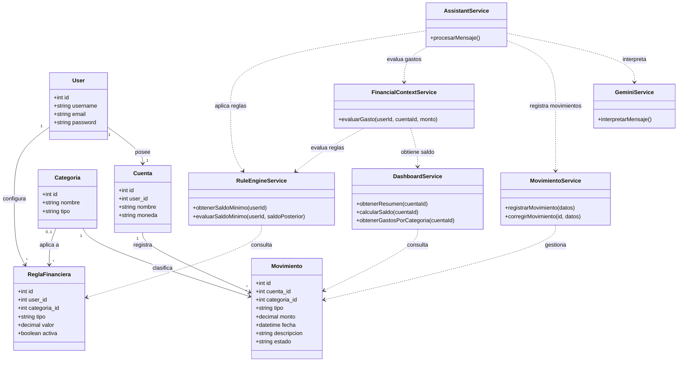

## Diagrama de clases - Primer flujo vertical

Este diagrama representa la arquitectura del primer flujo vertical funcional de Riplat. La lógica de negocio se concentra principalmente en los servicios, que se encargan de gestionar los movimientos, calcular la información del dashboard y evaluar las reglas financieras configuradas por el usuario. Para las operaciones mediante lenguaje natural, Gemini interpreta el mensaje y genera una operación estructurada, mientras que la validación, los cálculos y la ejecución quedan a cargo del backend desarrollado en Laravel.  